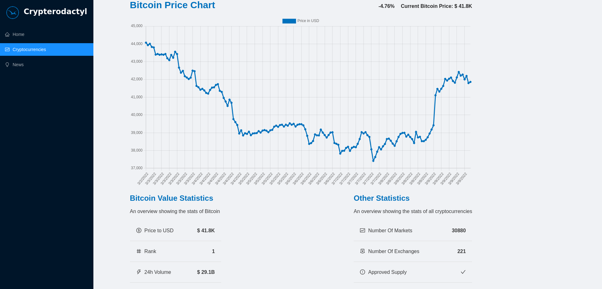

<p align="center">
  <a href="https://crypterodactyl.netlify.app/" rel="noopener">
 </a>
</p>

<h3 align="center">Crypterodactyl</h3>

<div align="center">

[]()
[](/LICENSE)

</div>

---

<p align="center"> Your daily cryptocurrency status report
    <br> 
</p>

## Table of Contents

- [About](#about)
- [Getting Started](#getting_started)
- [Deployment](#deployment)
- [Usage](#usage)
- [Built Using](#built_using)
- [Authors](#authors)

## About <a name = "about"></a>

The idea of this project is to give minute-by-minute information about the most relevant cryptocurrencies in the current market.

## Getting Started <a name = "getting_started"></a>

These instructions will get you a copy of the project up and running on your local machine for development and testing purposes. See [deployment](#deployment) for notes on how to deploy the project on a live system.

### Prerequisites

You will need to have [Nodejs](https://nodejs.org/en/) in your system.

Check the documentation to install it on your system.

Also, you'll need two api keys, one from [Bing News Search](https://www.microsoft.com/en-us/bing/apis/bing-news-search-api) and another from [CoinRanking](https://developers.coinranking.com/api). Once you get them, create a .env file in the root of your project and use them there.

### Installing

Once you have Node Js on your system, run `npm install` in order to get all the dependencies needed. You can see in the package.json all the scripts.

```
  "scripts": {
    "start": "react-scripts start",
    "build": "react-scripts build",
    "test": "react-scripts test",
    "eject": "react-scripts eject"
  },
```

## Usage <a name="usage"></a>

</a>

You can make changes in the components and pages folders.

In the project directory, you can run:

### `npm start`

Runs the app in the development mode.\
Open [http://localhost:3000](http://localhost:3000) to view it in the browser.

The page will reload if you make edits.\
You will also see any lint errors in the console.

### `npm test`

Launches the test runner in the interactive watch mode.\
See the section about [running tests](https://facebook.github.io/create-react-app/docs/running-tests) for more information.

### `npm run build`

Builds the app for production to the `build` folder.\
It correctly bundles React in production mode and optimizes the build for the best performance.

The build is minified and the filenames include the hashes.\
Your app is ready to be deployed!

See the section about [deployment](https://facebook.github.io/create-react-app/docs/deployment) for more information.

### `npm run eject`

**Note: this is a one-way operation. Once you `eject`, you can’t go back!**

If you aren’t satisfied with the build tool and configuration choices, you can `eject` at any time. This command will remove the single build dependency from your project.

Instead, it will copy all the configuration files and the transitive dependencies (webpack, Babel, ESLint, etc) right into your project so you have full control over them. All of the commands except `eject` will still work, but they will point to the copied scripts so you can tweak them. At this point you’re on your own.

You don’t have to ever use `eject`. The curated feature set is suitable for small and middle deployments, and you shouldn’t feel obligated to use this feature. However we understand that this tool wouldn’t be useful if you couldn’t customize it when you are ready for it.


## Deployment <a name = "deployment"></a>

You can deploy this page to Netlify.

## Built Using <a name = "built_using"></a>

- [React](https://reactjs.org/) - A JavaScript library for building user interfaces
- [Ant Design](https://ant.design/) - The world's second most popular React UI framework
- [Redux](https://redux.js.org/) - A Predictable State Container for JS Apps
- [Chart.js](https://www.chartjs.org/) - Simple yet flexible JavaScript charting for designers & developers
- [Create React App](https://create-react-app.dev/) - The best way to start building a new single-page application in React.

## ✍️ Authors <a name = "authors"></a>

- [@alejandrocardozo](https://github.com/Alejandro-Cardozo) - Build by
- [@adrianhajdin](https://github.com/adrianhajdin) - Idea & Initial Work